# One Shot · 电影分镜

输入故事情节，选择一种视觉风格，生成电影分镜图和每镜可独立复制的生图、视频提示词。

**37种风格，37张独立生成的参考图。** 下表按 **01–37** 排序；用 **S01–S37** 指定风格，点击图片查看完整原图。

作者：[gerrywrittenhousea76-design](https://github.com/gerrywrittenhousea76-design)。由原 [one-shot](https://github.com/gerrywrittenhousea76-design/one-shot) 扩展，原项目保留。

## 使用方式

在支持 Skills 和图像生成工具的环境中安装本仓库。使用 Codex 时，将整个仓库文件夹放进个人 Skills 目录，文件夹名称设为 `one-shot-storyboard`，保留里面的图片与 references。

```text
使用 $one-shot-storyboard。
故事：女子准备把未寄出的信扔掉，听见身后有人叫她，最后把信交给来人。
风格：S02 青蓝青春。
16秒，4格，每格16:9。生成分镜总览和每镜独立的生图、视频提示词。
```

尚未选风格时，可以说“根据我的故事推荐3种风格，我选完再生成”。也支持只要提示词、逐格独立生图，以及一镜到底的连续关键帧。

## 37种风格参考表

这些图片共用“未寄出的信”这个展示母题，便于比较色彩、光影、构图与质感。实际创作使用你自己的故事和人物，风格图中的人物、信与服装不会自动成为剧情设定。图片均为原创AI参考，不是电影截图，也不是跨图身份一致性测试。

| 序号 | 风格编号与名称 | 视觉特点 | 参考图（点击看原图） |
|:---:|---|---|---|
| 01 | **S01 · 武侠江湖**<br>动作与奇幻 | 青黑、灰白、少量暖金<br>侧逆光、薄雾、粗细适中的胶片颗粒 | <a href="assets/style-references/01-wuxia.png">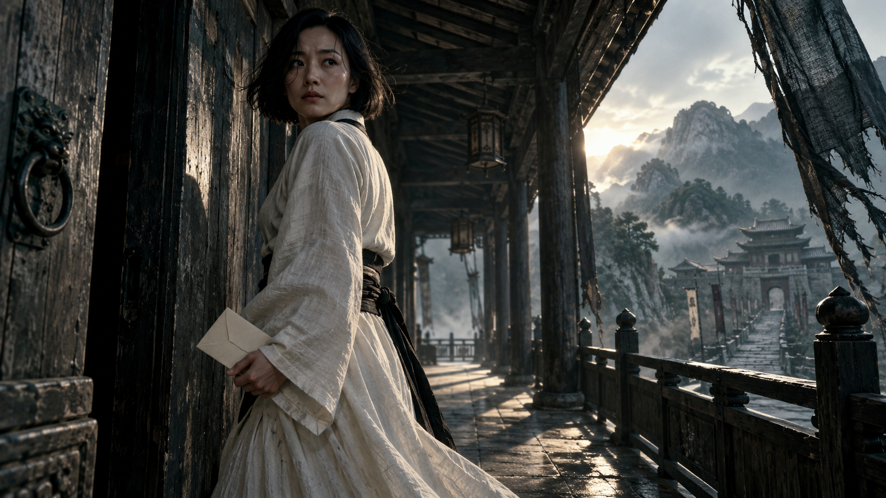</a> |
| 02 | **S02 · 青蓝青春**<br>青春与日常 | 冷青绿、淡蓝、褪色米白<br>自然侧逆光、轻微柔焦、细颗粒 | <a href="assets/style-references/02-quiet-youth.png">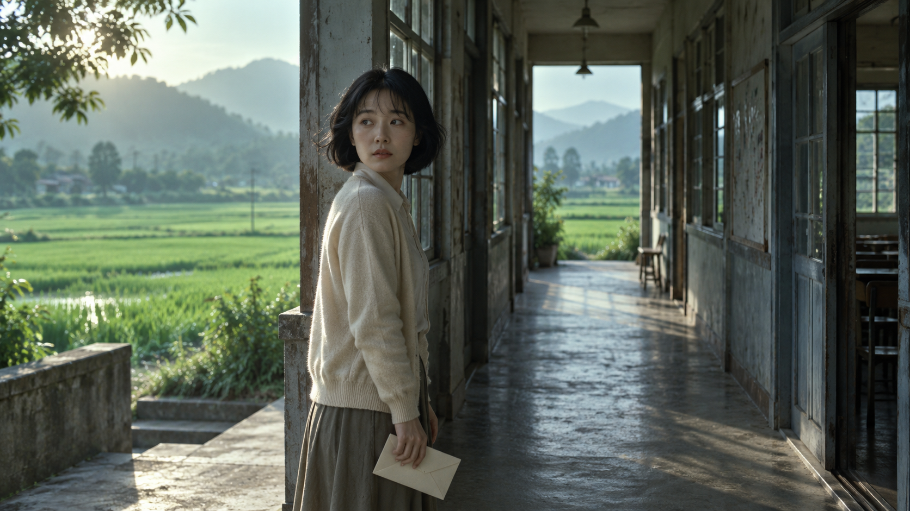</a> |
| 03 | **S03 · 春日诗意**<br>青春与日常 | 淡粉、浅紫、米白、嫩绿<br>漫射日光、浅柔光、自然肤色 | <a href="assets/style-references/03-spring-poetry.png">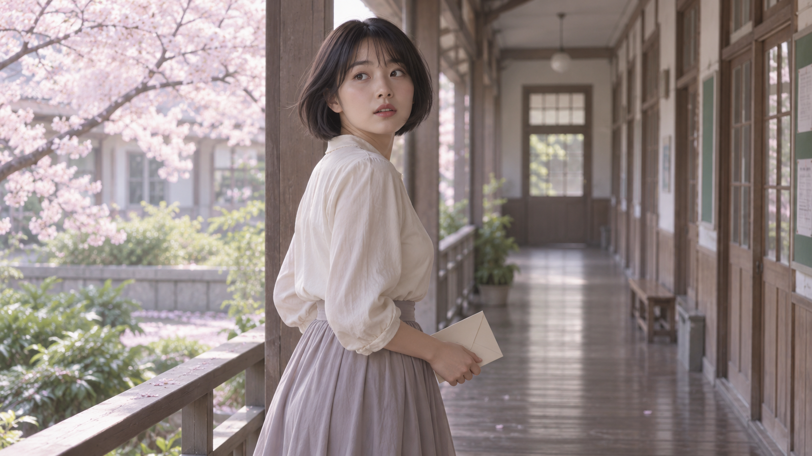</a> |
| 04 | **S04 · 都市梦境**<br>城市与复古 | 青绿、灰紫、少量暖橙<br>青色环境光与暖实景灯混合、柔焦颗粒 | <a href="assets/style-references/04-urban-dream.png">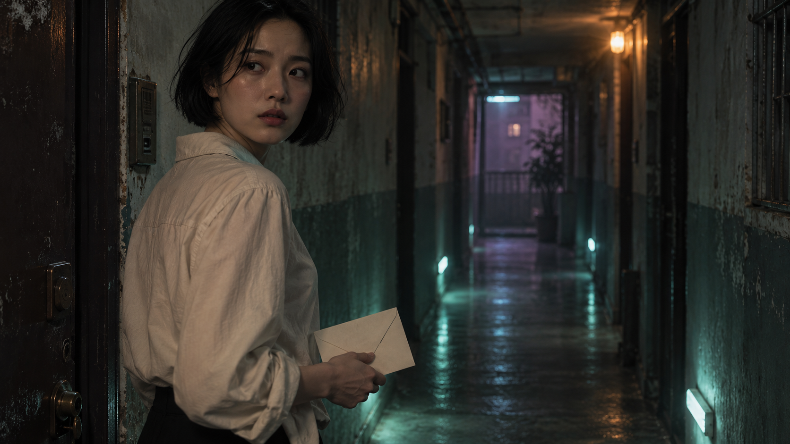</a> |
| 05 | **S05 · 田园浪漫**<br>田园与自然 | 草绿、乳白、暖金<br>柔暖自然光、轻薄胶片质感 | <a href="assets/style-references/05-pastoral-romance.png">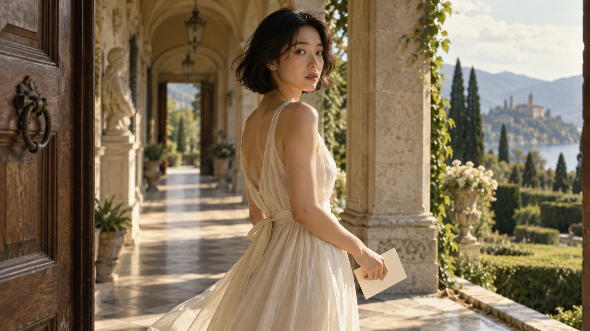</a> |
| 06 | **S06 · 几何科幻**<br>动作与奇幻 | 冷白、银灰、浅蓝<br>均匀冷光、洁净金属、锐利空间层次 | <a href="assets/style-references/06-geometric-scifi.png">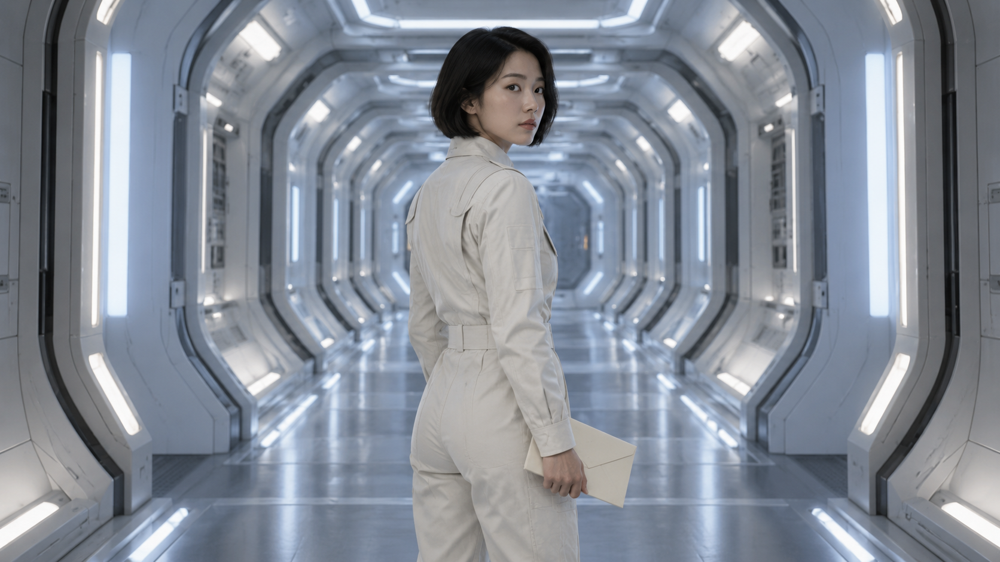</a> |
| 07 | **S07 · 海岸恋曲**<br>田园与自然 | 海蓝、灰青、肤色暖光<br>海风、自然侧光、低饱和柔焦 | <a href="assets/style-references/07-coastal-romance.png">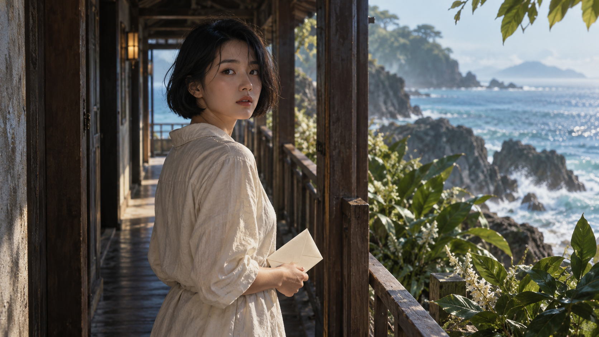</a> |
| 08 | **S08 · 蓝色记忆**<br>青春与日常 | 浅蓝、灰蓝、雪白、点状暖黄<br>冷天光与远处暖灯、轻微颗粒 | <a href="assets/style-references/08-blue-memory.png">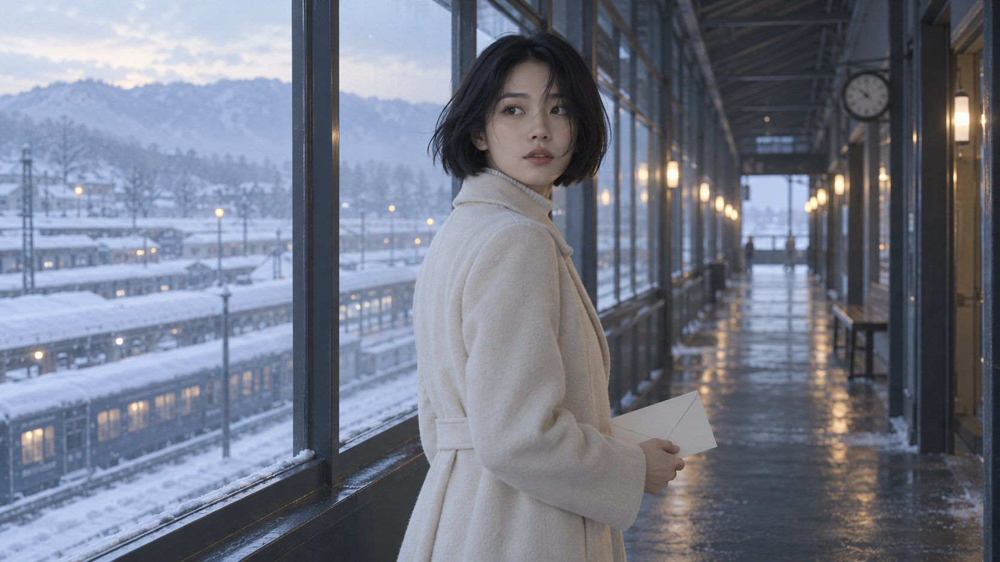</a> |
| 09 | **S09 · 河畔纪实**<br>城市与复古 | 浊绿、灰蓝、昏黄<br>单一实景灯、潮湿反射、粗粝颗粒 | <a href="assets/style-references/09-riverside-doc.png">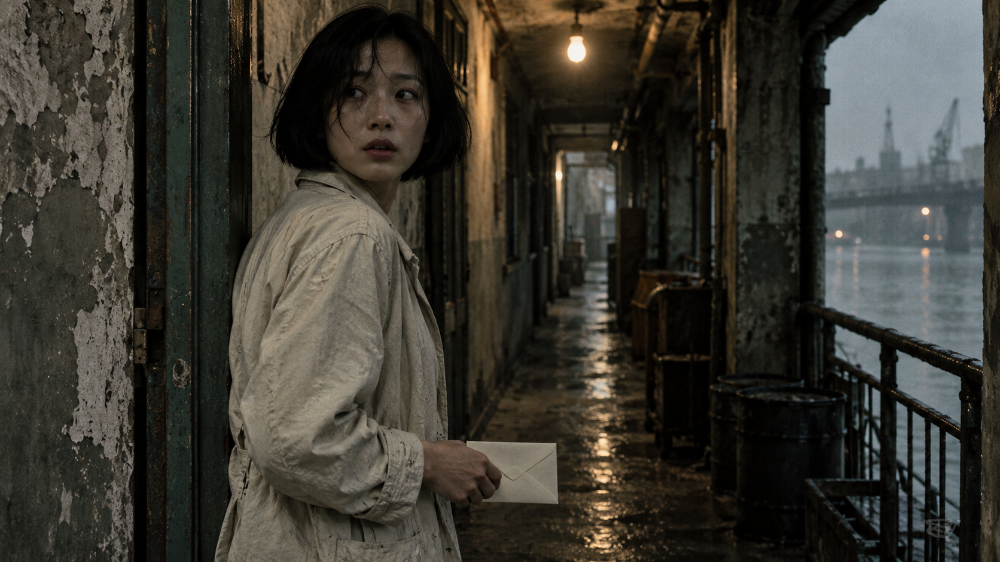</a> |
| 10 | **S10 · 木屋慢生活**<br>青春与日常 | 原木、米白、抹茶绿<br>柔侧光、真实木纹、低反差 | <a href="assets/style-references/10-wooden-life.png">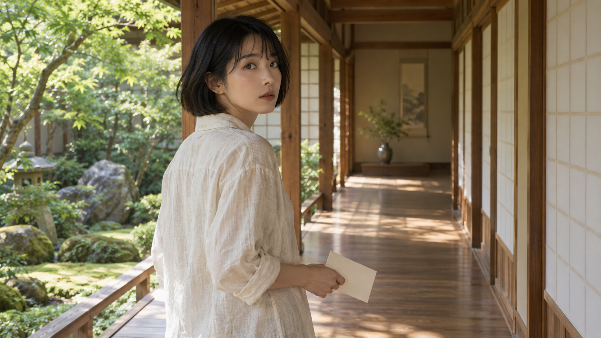</a> |
| 11 | **S11 · 蓝色超现实**<br>实验与梦幻 | 深蓝、透明浅蓝、橙红<br>油画笔触、蓝色空气、亮色小物 | <a href="assets/style-references/11-blue-surreal.png">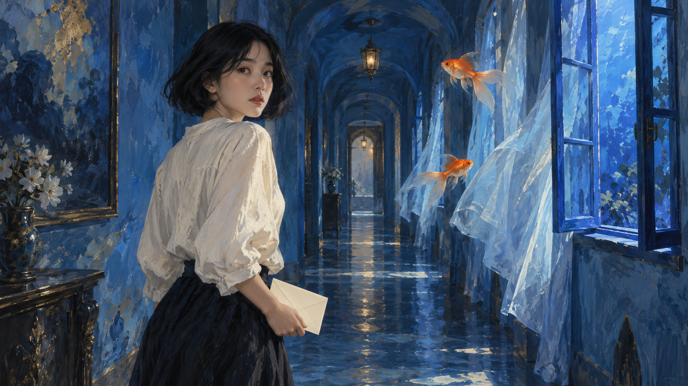</a> |
| 12 | **S12 · 双重曝光**<br>实验与梦幻 | 深蓝、鲜绿、米白、淡粉<br>双重曝光边缘、清楚轮廓、绘画纹理 | <a href="assets/style-references/12-double-exposure.png">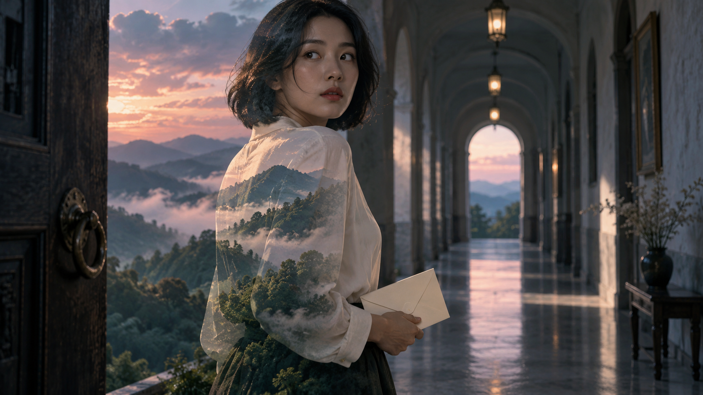</a> |
| 13 | **S13 · 海边实拍**<br>田园与自然 | 绿松石、纯白、自然绿<br>明亮真实日光、清楚水纹、少量颗粒 | <a href="assets/style-references/13-beach-document.png">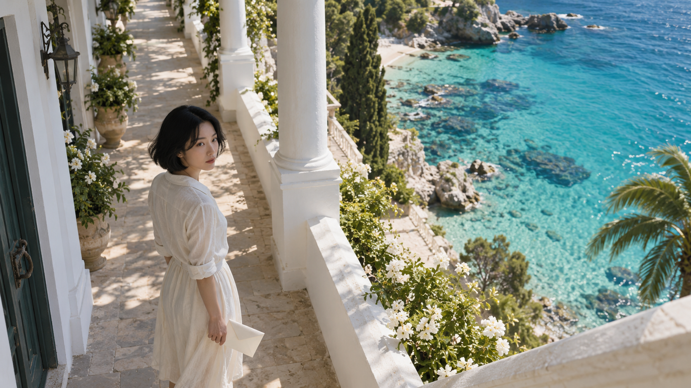</a> |
| 14 | **S14 · 竹林写意**<br>动作与奇幻 | 竹绿、雾白、淡灰<br>自然散射光、轻雾、衣料纹理 | <a href="assets/style-references/14-bamboo-mist.png">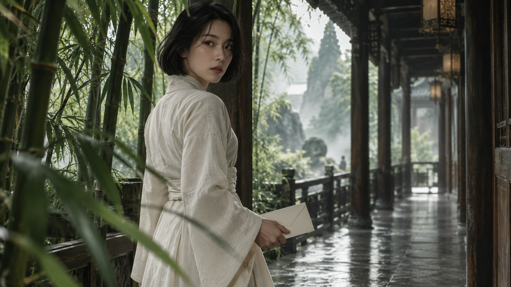</a> |
| 15 | **S15 · 金鱼夏日**<br>青春与日常 | 清水蓝、金鱼橙、柔白<br>透水光斑、真实水纹、细颗粒 | <a href="assets/style-references/15-goldfish-summer.png">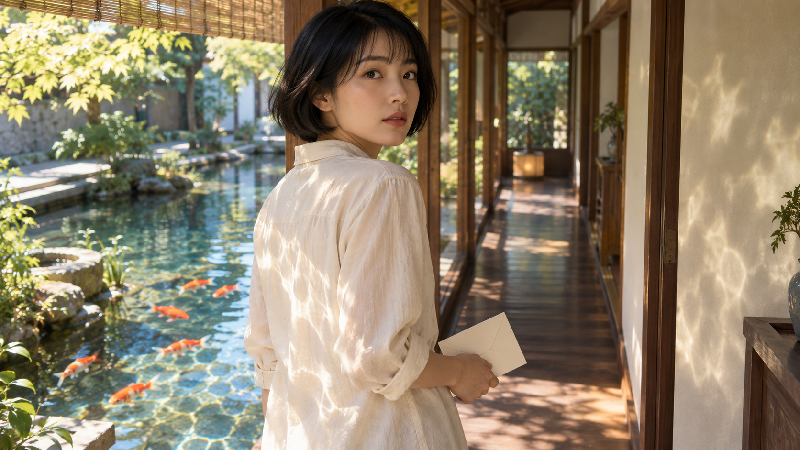</a> |
| 16 | **S16 · 森林庆典**<br>田园与自然 | 叶绿、米白、暖金<br>金色散射光、复古织物、柔和光晕 | <a href="assets/style-references/16-forest-celebration.png">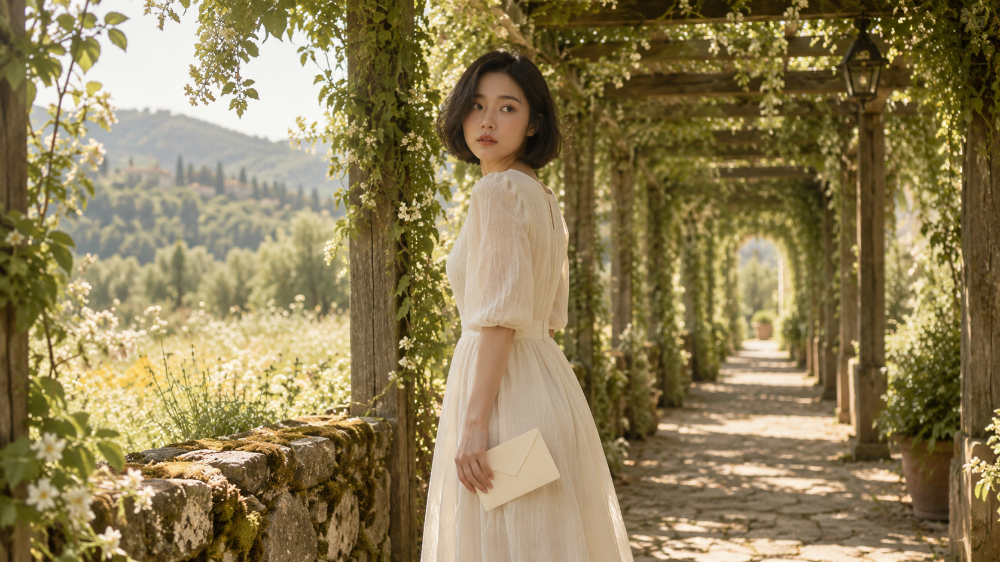</a> |
| 17 | **S17 · 地中海夏日**<br>田园与自然 | 橄榄绿、杏黄、淡蓝<br>强日光与树荫、真实肤色、细颗粒 | <a href="assets/style-references/17-mediterranean-summer.png">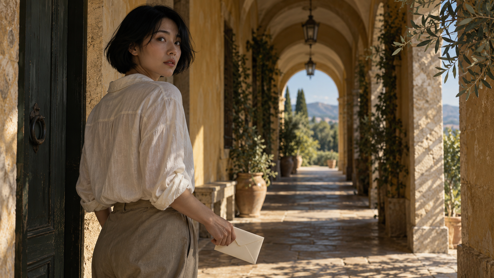</a> |
| 18 | **S18 · 古典花园**<br>田园与自然 | 暖棕、草绿、乳白<br>晨昏侧光、薄纱与石材、低饱和 | <a href="assets/style-references/18-classical-garden.png">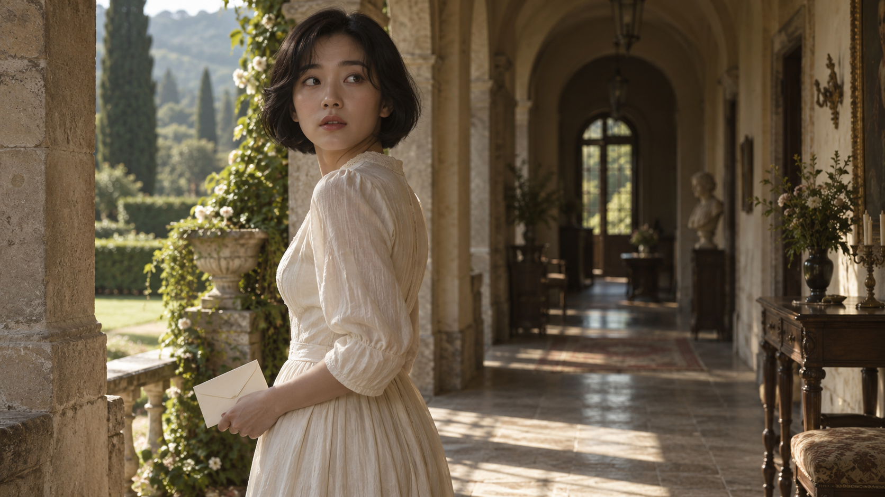</a> |
| 19 | **S19 · 邮轮古典**<br>城市与复古 | 海蓝、乳白、木棕、暖金<br>柔海光、木材与布料、暖冷平衡 | <a href="assets/style-references/19-ocean-liner.png">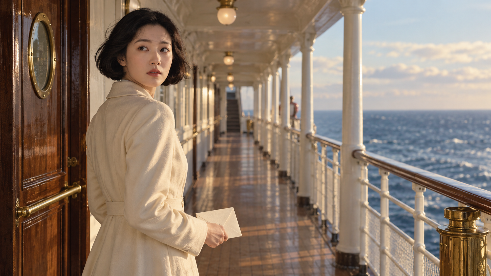</a> |
| 20 | **S20 · 巨物美学**<br>动作与奇幻 | 沙金、象牙白、深棕<br>单侧光束、尘雾、巨大明暗层次 | <a href="assets/style-references/20-monumental.png">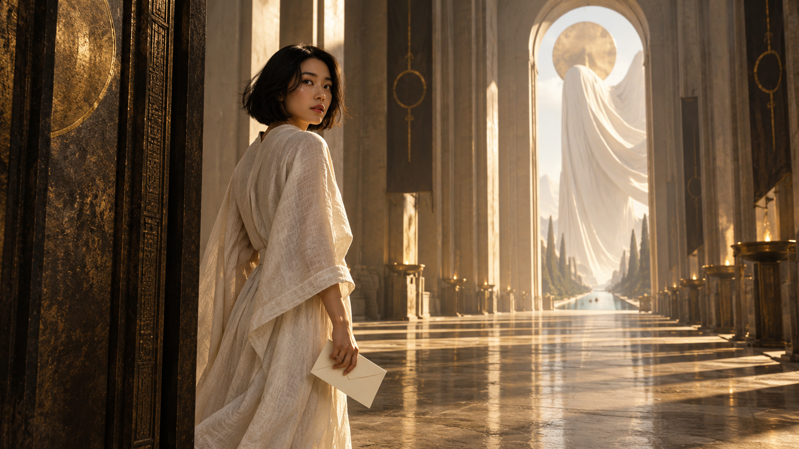</a> |
| 21 | **S21 · 日系日常**<br>青春与日常 | 清冷蓝、米白、浅绿<br>柔天光、水光或窗光、细颗粒 | <a href="assets/style-references/21-everyday-japan.png">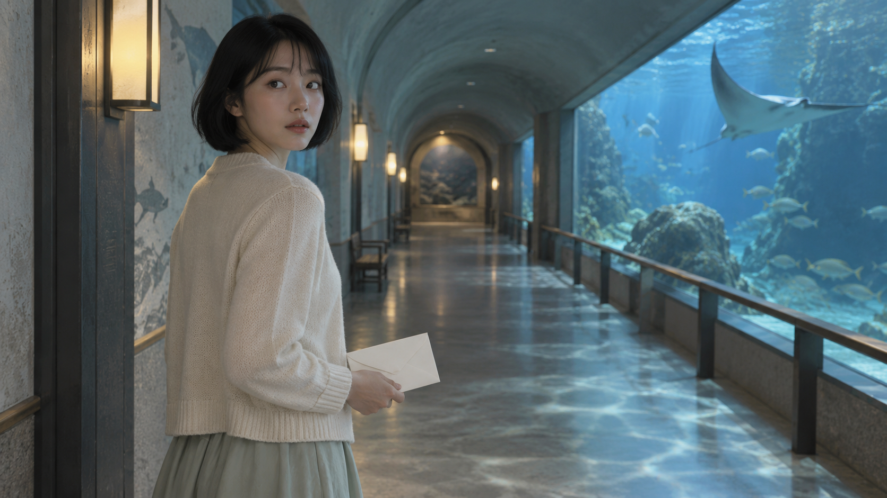</a> |
| 22 | **S22 · 生活观察**<br>青春与日常 | 浅青、木棕、暖灰<br>漫射光、真实皮肤、适度景深 | <a href="assets/style-references/22-observant-home.png">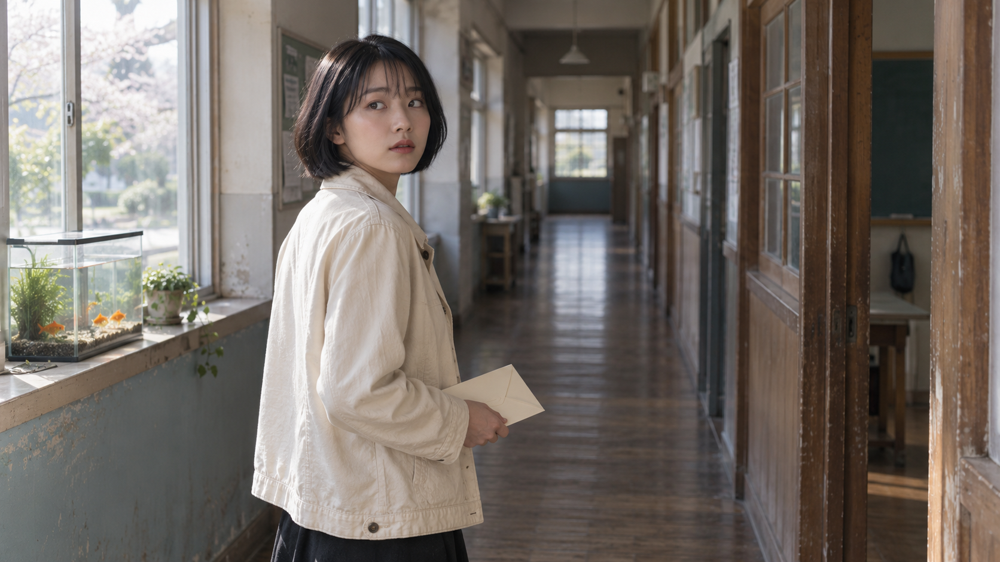</a> |
| 23 | **S23 · 童话冒险**<br>实验与梦幻 | 暖黄、浅蓝、橙红<br>温暖侧光、立体细节、复古色块 | <a href="assets/style-references/23-storybook-adventure.png">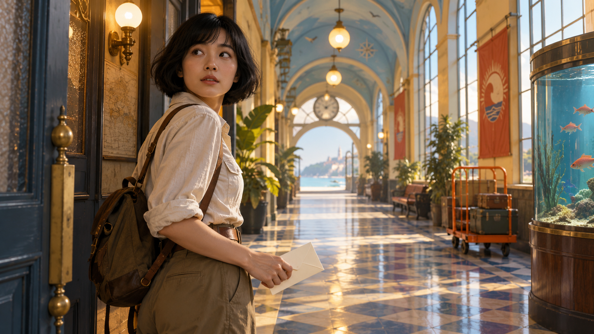</a> |
| 24 | **S24 · 都市观察**<br>城市与复古 | 灰绿、米白、局部红<br>城市窗光、低饱和、自然材质 | <a href="assets/style-references/24-taiwan-observation.png">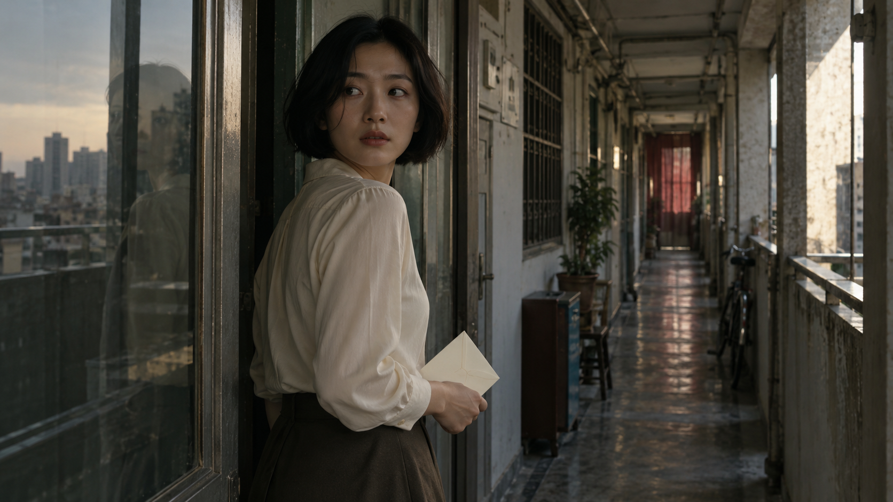</a> |
| 25 | **S25 · 青绿幻境**<br>动作与奇幻 | 青绿、雾白、银色、少量红<br>戏剧侧光、柔光晕、丝绸反光 | <a href="assets/style-references/25-green-fantasy.png">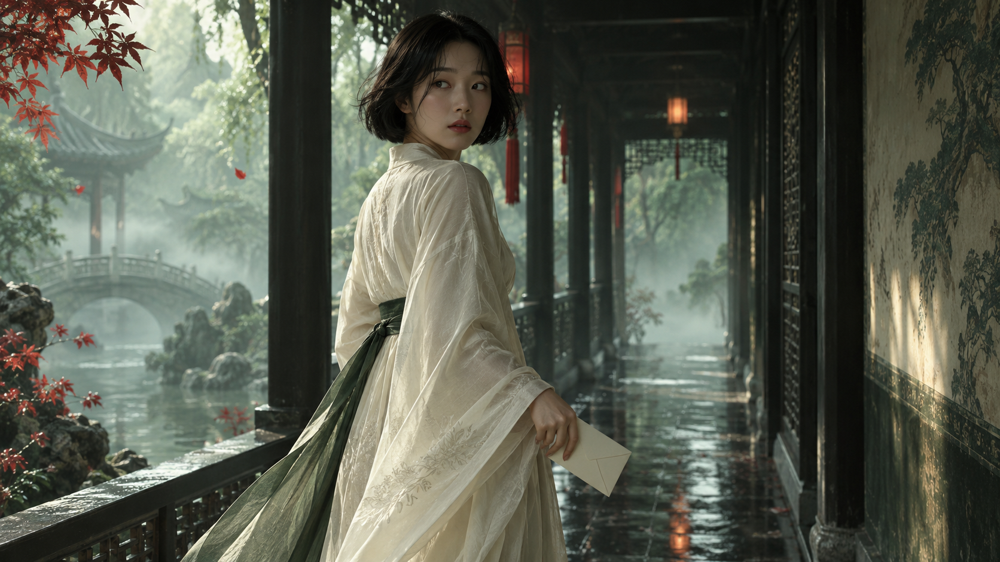</a> |
| 26 | **S26 · 霓虹都市**<br>城市与复古 | 荧光绿、冷蓝、暖黄、红<br>实景霓虹、背景拖影、粗颗粒 | <a href="assets/style-references/26-neon-city.png">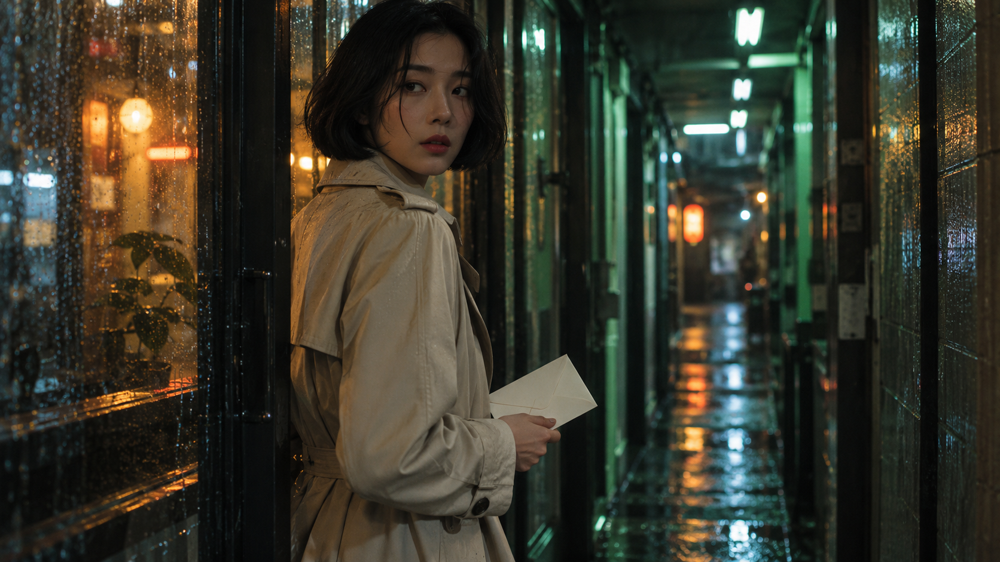</a> |
| 27 | **S27 · 戏曲后台**<br>城市与复古 | 朱红、深黑、象牙白、暖金<br>暖戏灯、刺绣布料、浓黑层次 | <a href="assets/style-references/27-opera-backstage.png">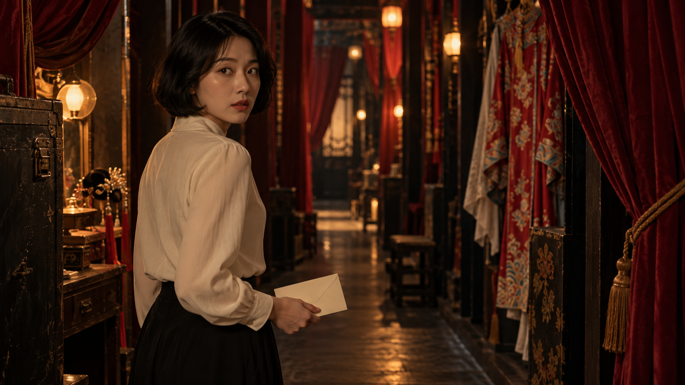</a> |
| 28 | **S28 · 草木观察**<br>田园与自然 | 鲜绿、肤色、土棕<br>真实斑驳日光、皮肤纹理、细颗粒 | <a href="assets/style-references/28-botanical-observation.png">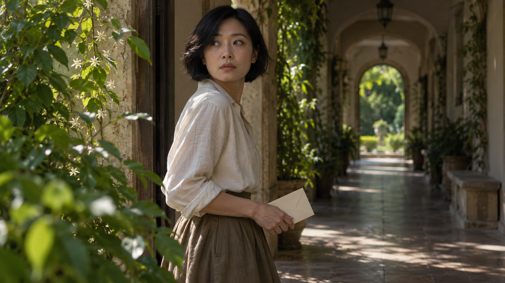</a> |
| 29 | **S29 · 乡村温润**<br>田园与自然 | 溪绿、木棕、米黄<br>柔日光、编织材质、旧木纹 | <a href="assets/style-references/29-rural-warmth.png">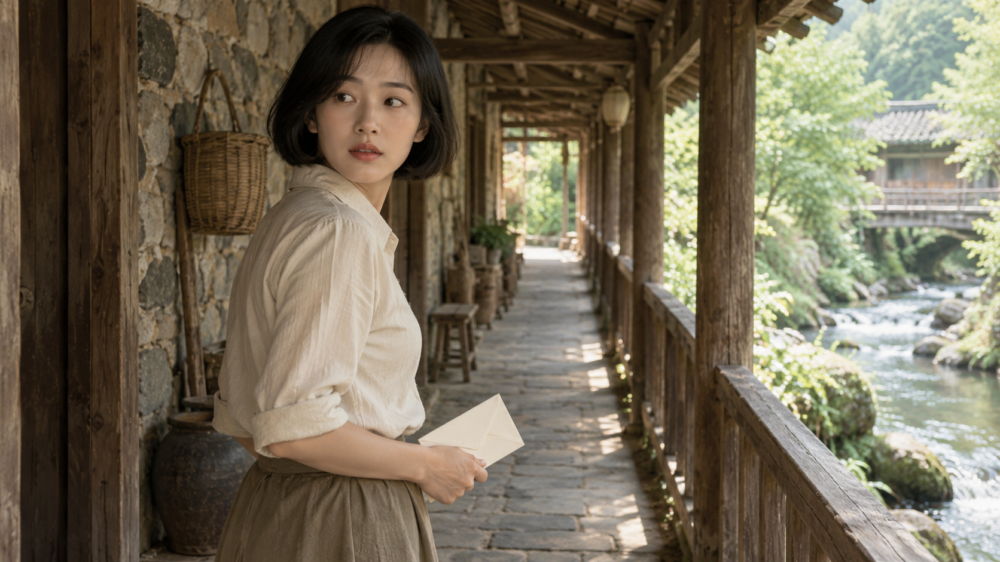</a> |
| 30 | **S30 · 田园成长**<br>田园与自然 | 麦绿、暖白、棕红<br>柔自然光、田野质感、温暖颗粒 | <a href="assets/style-references/30-countryside-growth.png">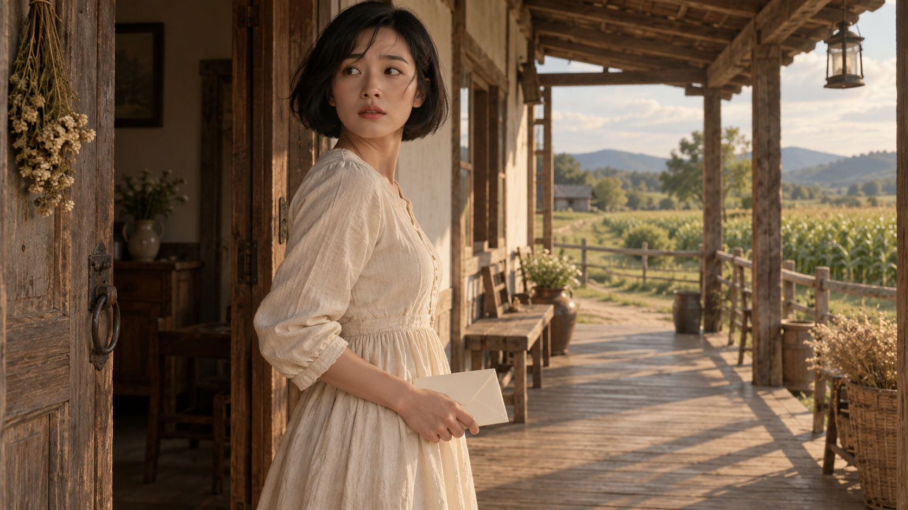</a> |
| 31 | **S31 · 窗边剪影**<br>田园与自然 | 墨绿、暗棕、暖白<br>逆光保轮廓、深暗部、胶片纹理 | <a href="assets/style-references/31-window-silhouette.png">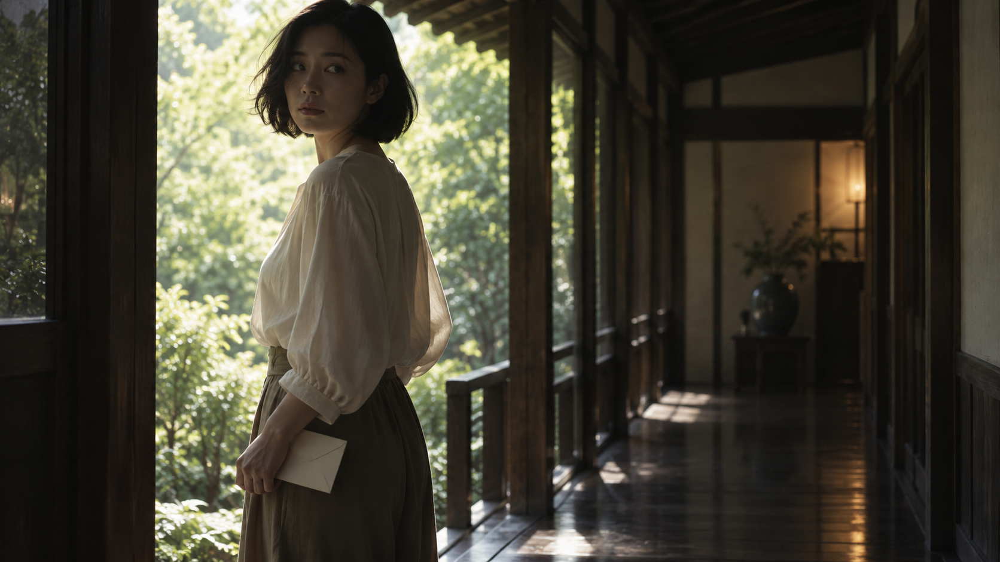</a> |
| 32 | **S32 · 山野田园**<br>田园与自然 | 草绿、蓝天、米白、暖黄<br>明亮自然光、清楚草木、轻胶片感 | <a href="assets/style-references/32-alpine-pastoral.png">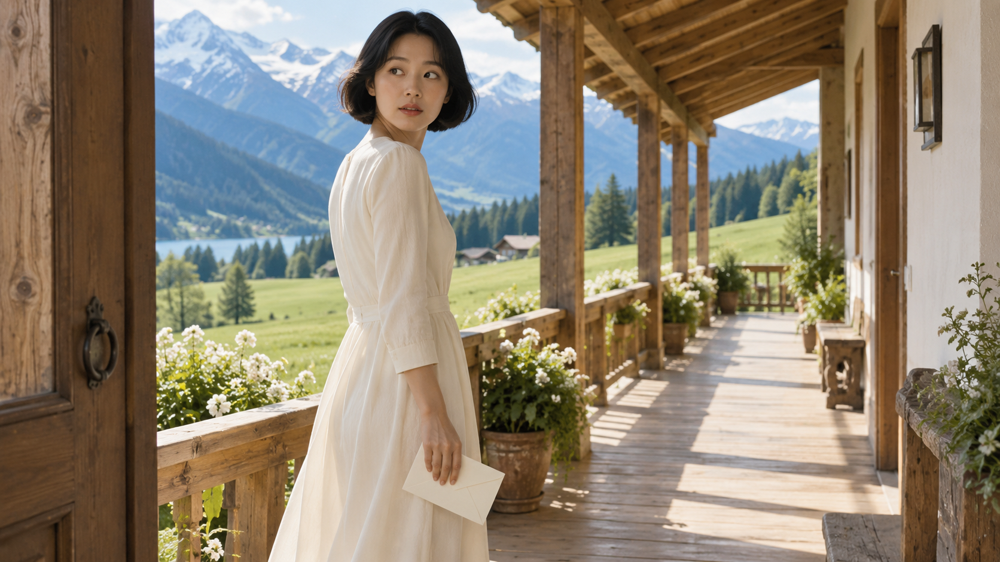</a> |
| 33 | **S33 · 红衣古风**<br>动作与奇幻 | 朱红、暖金、深棕<br>暖室内柔光、丝绸反光、少量光晕 | <a href="assets/style-references/33-crimson-fantasy.png">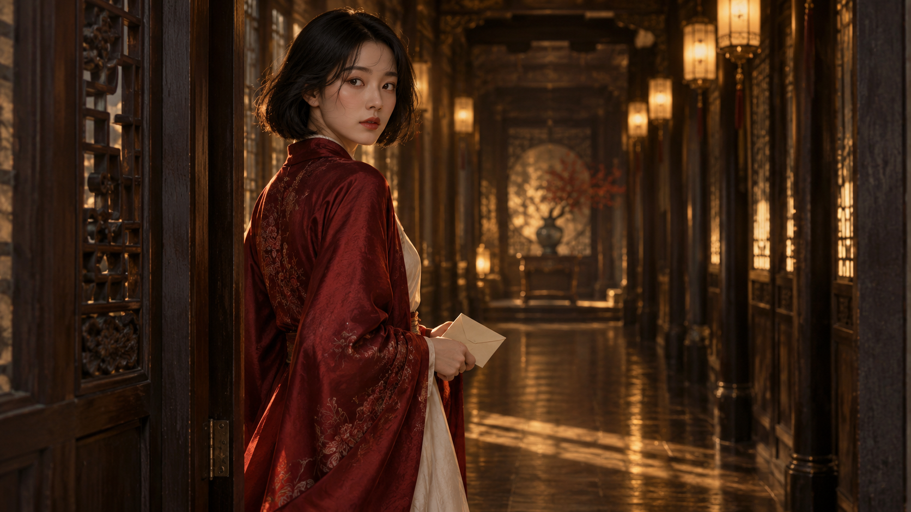</a> |
| 34 | **S34 · 复古舞厅**<br>城市与复古 | 暖黄、朱红、深绿<br>暖实景灯、柔光晕、衣料颗粒 | <a href="assets/style-references/34-vintage-ballroom.png">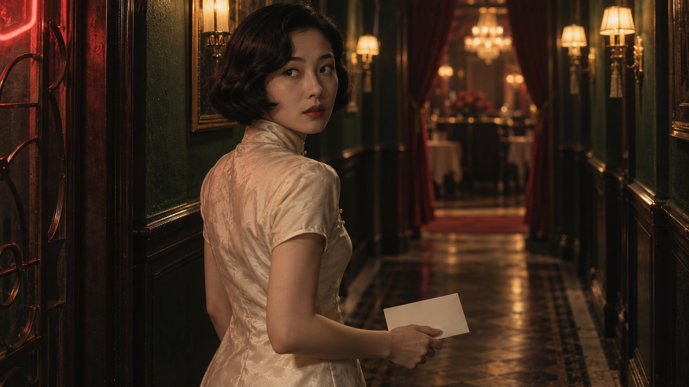</a> |
| 35 | **S35 · 英伦复古**<br>田园与自然 | 暖棕、玫瑰粉、橄榄绿<br>暖散射光、柔焦、复古布料 | <a href="assets/style-references/35-english-retro.png">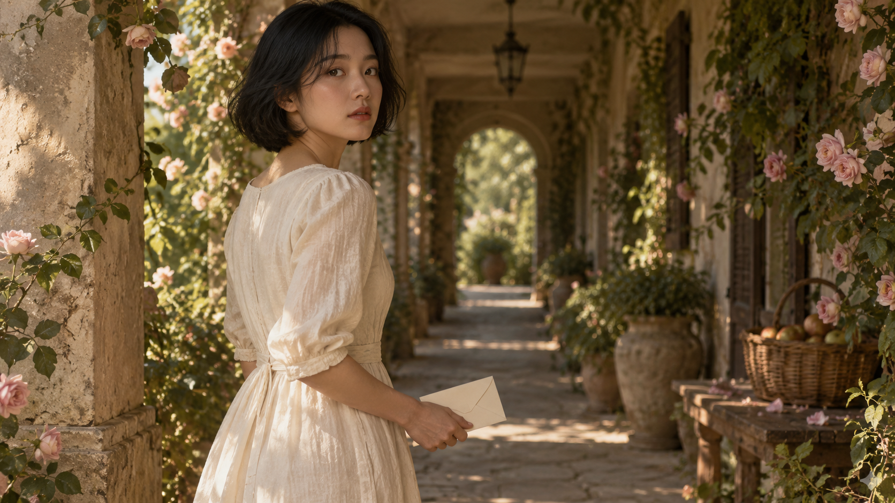</a> |
| 36 | **S36 · 旧城童年**<br>城市与复古 | 暖黄、木棕、暗绿<br>午后斑驳光、旧墙质感、暖颗粒 | <a href="assets/style-references/36-courtyard-memory.png">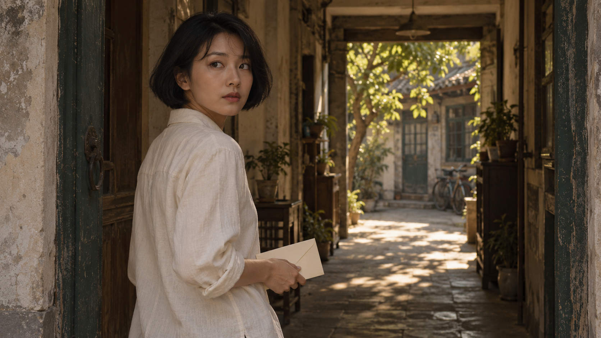</a> |
| 37 | **S37 · 单车青春**<br>青春与日常 | 叶绿、浅蓝、暖白<br>明亮日光、浅柔焦、自然暖肤色 | <a href="assets/style-references/37-bicycle-youth.png">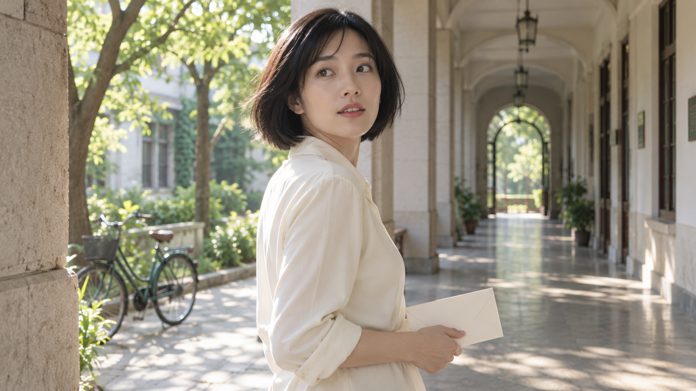</a> |

每个编号对应完整风格卡：[风格索引](references/style-index.md) · [风格配方](风格参考图提示词.md) · [图片文件与校验清单](assets/image-manifest.json)。

## 实际分镜示例

故事：准备扔掉未寄出的信 → 停手 → 听见来人并回望 → 把信交给来人。风格 S02，4格剪辑分镜。

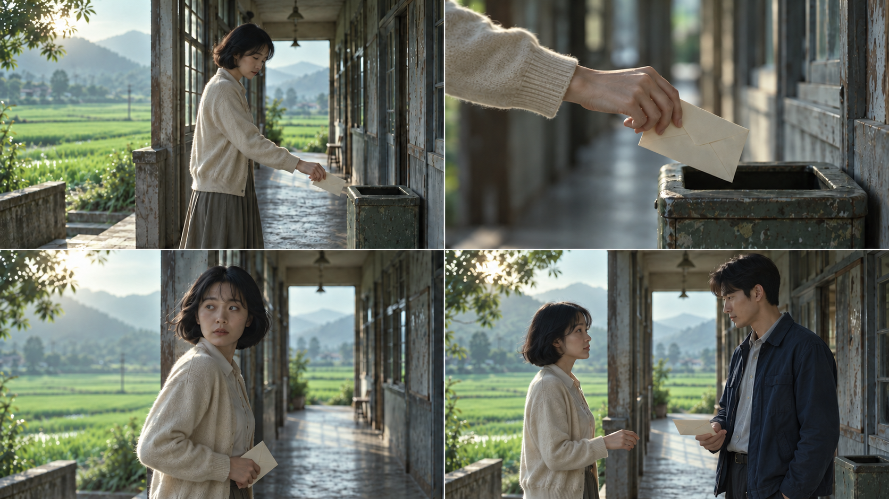

[逐镜生图与视频提示词](examples/未寄出的信/分镜说明.md) · [结构化分镜文档](examples/未寄出的信/board.json)。这是一张四格总览，已经查看并修正交接动作；没有生成动态视频、口型或声音。

## Skill 怎样工作

先整理故事的触发、选择与结果，再确定人物、道具、场景与镜头路径；将所选风格转成具体视觉属性，最后生成分镜图并查看实际结果。风格改变视觉，不改掉用户指定的职业、人物关系或结局。

[Skill 入口](SKILL.md) · [与 one-shot 的结合](结合说明.md) · [资料来源](references/provenance.md) · [验收记录](验收记录.md)。

仓库中的 `风格选择册.html` 是离线选择页，下载整个仓库后在本地打开，可搜索、选择风格并复制调用指令。GitHub 的文件浏览页显示HTML源码；首页的上表可以直接浏览全部37张参考图。

## 使用许可

沿用作者原 one-shot 项目的非商业使用政策。个人非商业学习、测试和创作可按许可使用；商用需联系作者取得书面授权。完整条款见 [LICENSE.md](LICENSE.md)，申请可通过 [商用授权 Issue](https://github.com/gerrywrittenhousea76-design/one-shot-storyboard/issues/new?template=commercial-license.yml)。本项目是公开分享的受限许可项目，不称为开放源代码项目。

## 维护工具

```sh
python scripts/get_style.py S26
python scripts/build_gallery.py --strict
python scripts/validate_board.py examples/未寄出的信/board.json
```

图册维护需要 Python 与 Pillow；其他两个脚本只用 Python 标准库。正常调用 Skill 不需要手动运行维护脚本。文档结构检查不替代看图，也不证明动态视频质量。
