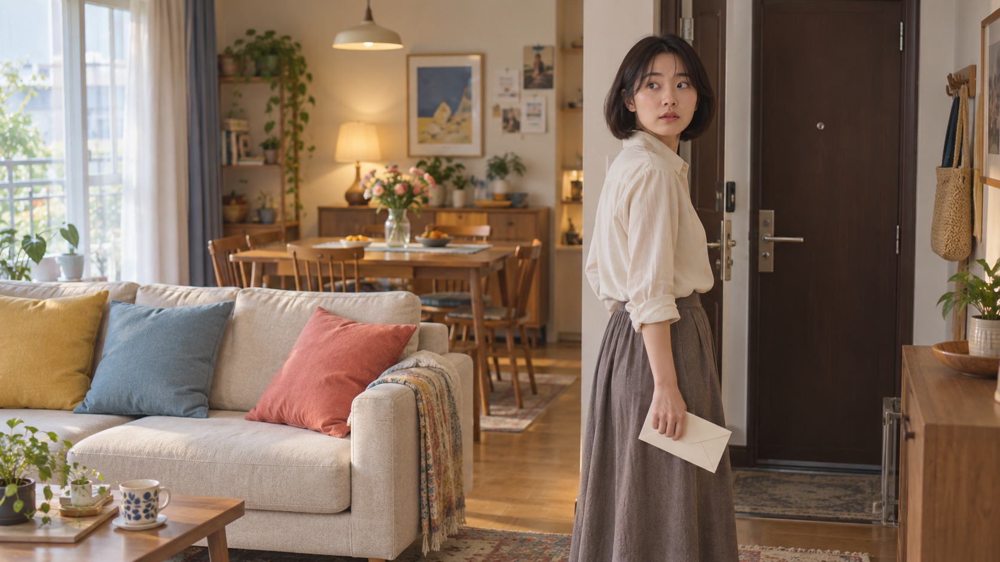
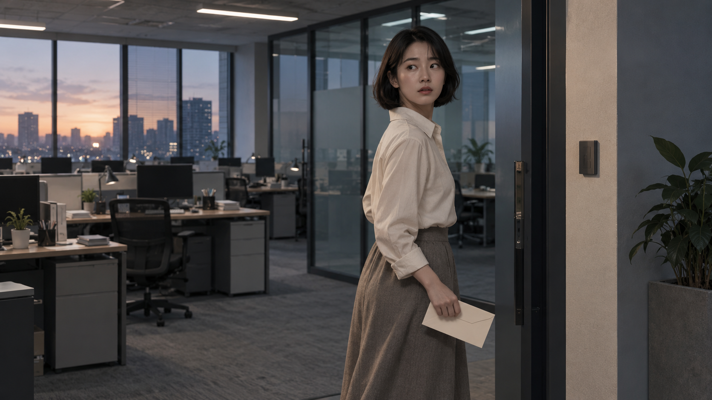
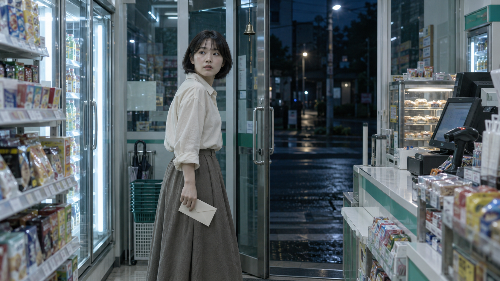
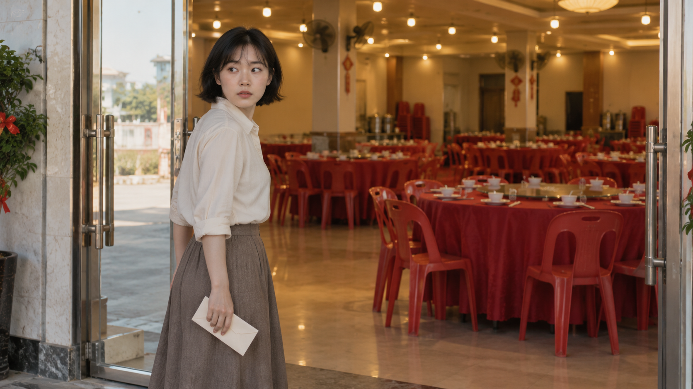
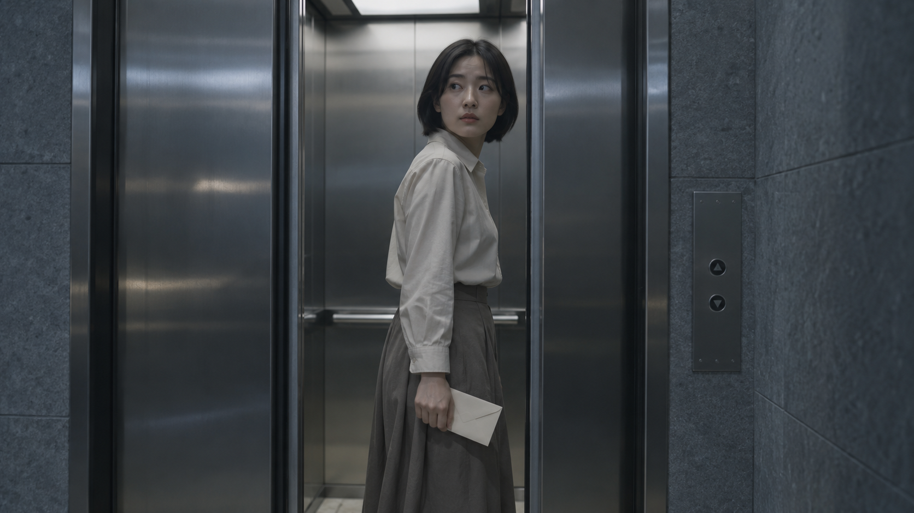
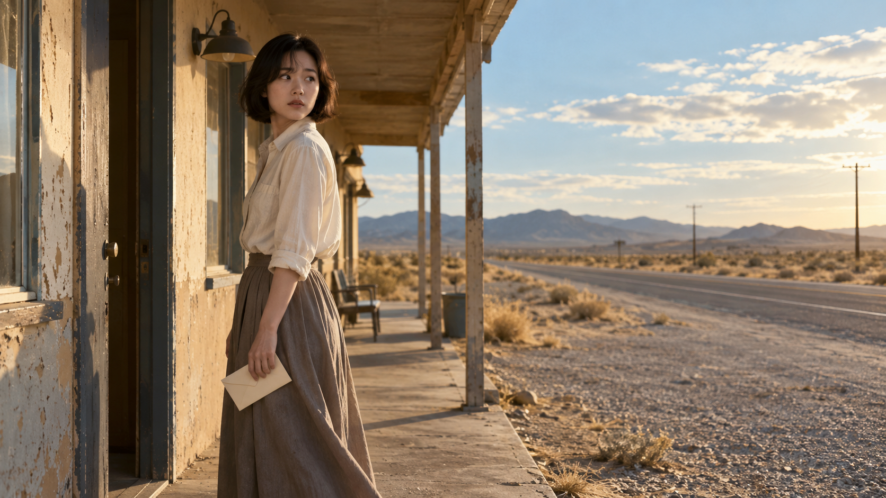
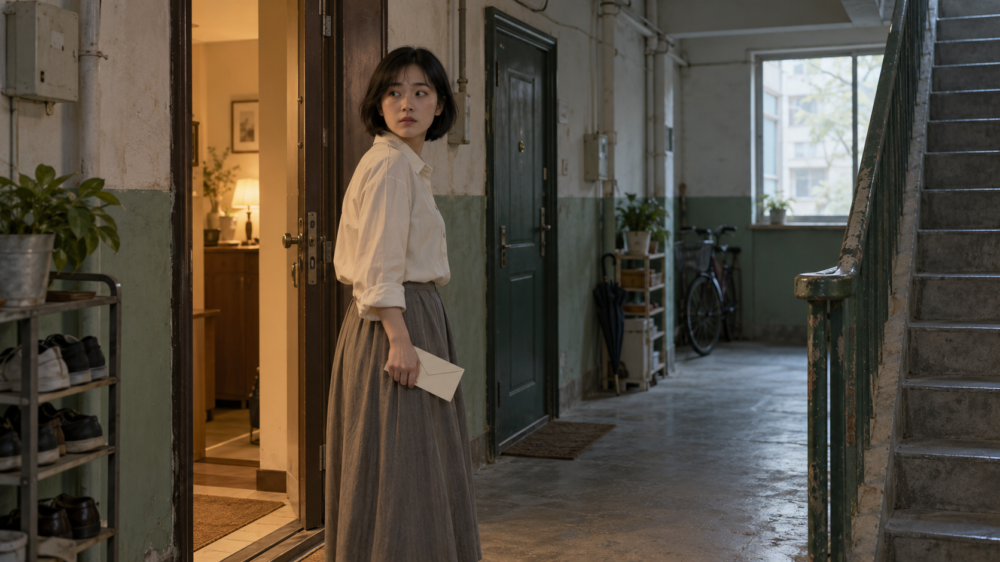
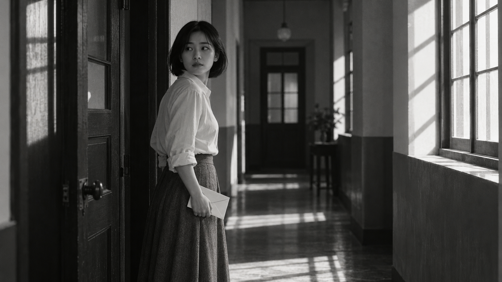
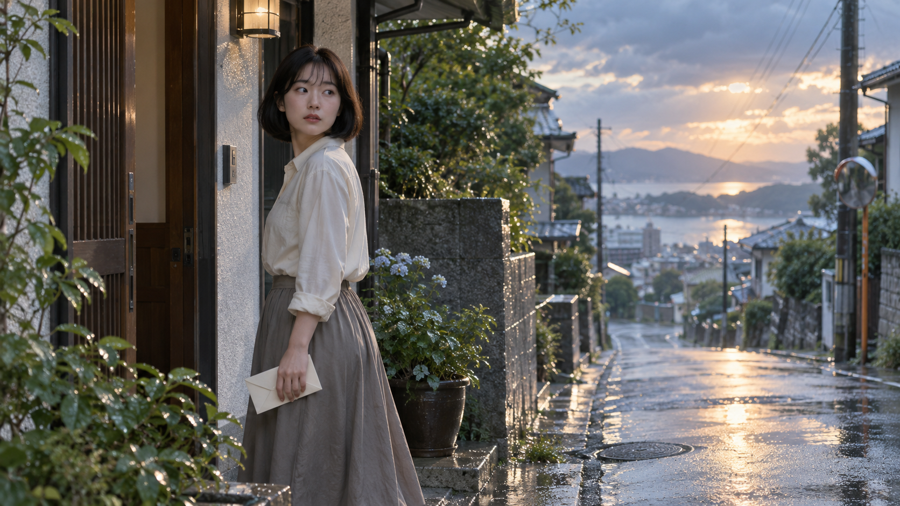
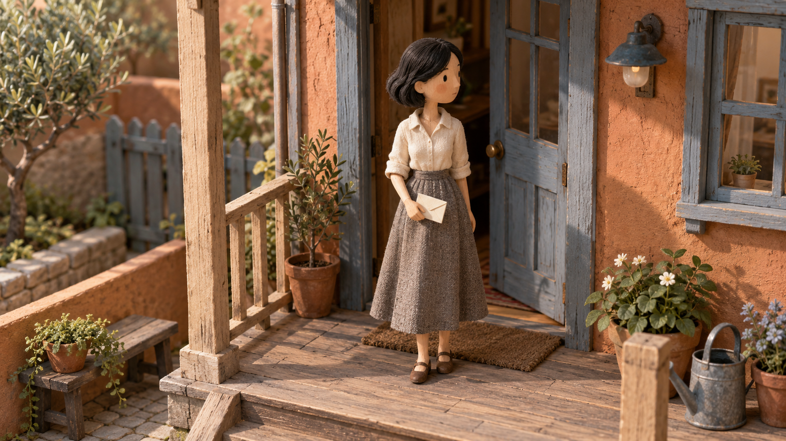

# 小夫导演 · Xiaofu Director

给一句故事，选择视觉方向，生成分镜图，并拿到逐镜独立的生图和视频提示词。

**47种视觉方向，47张实际参考图。** 本版重写全部风格卡与镜头指南，新增S38–S47十种情景剧方向。S01–S37图片保留，说明以实际画面重新编写。

## 使用教程

下载完整仓库，把文件夹命名为 xiaofu-director，放到支持 Skills 的环境中。保留图片、references 与 scripts。运行环境需要提供图像工具。安装与修改步骤见 [完整使用教程](使用教程.md)。

~~~text
使用 $xiaofu-director。
故事：室友藏起最后一个饺子，听见门锁响，以为要被发现；来人放下一盒新买的饺子，她把藏着的饺子默默放回盘里。
风格：S38 家庭喜剧。
20秒，4格，每格16:9。
生成分镜图，以及每镜独立的生图提示词和视频提示词。
~~~

没有风格方向，可以先要求推荐3种并展示参考图。已有风格和故事时可直接生成。一镜到底会按同一连续镜头的关键帧来设计。

## 看图选择

按S01–S47调用，点击图片打开原图。也可以打开 [离线风格选择册](风格选择册.html) 按分类和用途筛选、填写故事并复制指令。S08蓝色记忆与S26霓虹都市保留编号和名称。其余部分名称更新，以当前表为准。

| 编号 | 风格 | 颜色与光线 | 参考图 |
|---|---|---|---|
| S01 | 雾山木廊 | 炭黑、雾灰、亚麻白；廊外亮天空勾出肩线，廊内不补成通亮 |  |
| S02 | 青绿回廊 | 稻绿、石灰、米白；开敞廊侧的日光均匀落在脸上 |  |
| S03 | 樱影春日 | 花粉、浅木褐、暖白；明亮散射光透过花枝，阴影柔软 |  |
| S04 | 湿夜孤廊 | 墨绿、暗褐、微量琥珀；低位反光与几盏远处小灯分开照明 |  |
| S05 | 石廊日光 | 砂金、奶油白、叶绿；斜射午后光在石柱与地面形成大块亮面 |  |
| S06 | 银白舱室 | 冷白、银灰、微蓝；重复灯带提供均匀冷光，脸部保留明暗 |  |
| S07 | 海岸木屋 | 深木褐、海蓝、奶白；海面反射补亮人物，屋檐下保留阴影 |  |
| S08 | 蓝色记忆 | 灰蓝、浅蓝、少量暖黄；窗外冷光与室内小灯分别照亮不同区域 |  |
| S09 | 河岸旧楼 | 灰褐、烟蓝、低饱和米白；阴天水面反光，室内亮度不过分提升 |  |
| S10 | 木屋午后 | 蜂蜜褐、暖白、浅绿；窗外树影切分暖日光 |  |
| S11 | 蓝幕浮鱼 | 群青、钴蓝、少量橙；大面积蓝色漫反射让橙色小物成为亮点 |  |
| S12 | 双层暮色 | 暮紫、烟灰、晚霞橙；主体轮廓由夕照勾边，叠层保留不同亮度 |  |
| S13 | 白阶碧海 | 瓷白、碧蓝、浅砂金；无遮蔽晴光，人物阴影仍能辨认 |  |
| S14 | 竹影长廊 | 竹绿、深褐、灰白；竹叶遮挡阳光，廊侧形成细碎亮斑 |  |
| S15 | 池水夏光 | 浅金、池蓝、叶绿；水面反射与树叶影子交替落在衣服上 |  |
| S16 | 藤架午后 | 草绿、浅金、象牙白；葡萄藤筛下斑驳光，人物眼睛不落在死黑影里 |  |
| S17 | 暖石拱廊 | 土黄、暖褐、灰绿；低角度暖日光与拱门阴影分区 |  |
| S18 | 花园回廊 | 嫩绿、奶油白、砂褐；柔和晴光，近处人像亮度低于背景花园一点 |  |
| S19 | 海上长廊 | 栗褐、奶白、海蓝；窗侧自然光与内部暖灯混合 |  |
| S20 | 巨厅光束 | 深金、炭褐、乳白；高处开口投下一束明亮光，周围仍偏暗 |  |
| S21 | 水族长廊 | 水蓝、青灰、暖白；水箱蓝光与少量壁灯照出不同色温 |  |
| S22 | 老屋窗光 | 米白、淡灰、旧木褐；窗边自然光柔和进入室内 |  |
| S23 | 彩窗奇旅 | 金黄、浅蓝、少量砖红；圆灯与彩窗共同照亮地面，饱和度受控 |  |
| S24 | 都市观察 | 灰绿、米白、烟褐；侧窗透入阴天日光，深处照明自然衰减 |  |
| S25 | 苔院青雾 | 深青绿、石灰、一点暗红；雾天柔光穿过叶隙，室内暗面不染荧光绿 |  |
| S26 | 霓虹都市 | 墨绿、琥珀、少量冷蓝；绿色顶灯与橙色窗灯形成局部色差 |  |
| S27 | 红帘后台 | 酒红、深木褐、暖金；灯镜附近局部明亮，帘后保持暗 |  |
| S28 | 草木庭院 | 叶绿、灰石、奶白；叶隙阳光打亮局部，整体对比温和 |  |
| S29 | 河村木舍 | 旧木褐、溪绿、米白；开敞溪侧的自然光照亮廊边 |  |
| S30 | 田垄晚风 | 麦金、木褐、暖白；较低的太阳在地面留下长影 |  |
| S31 | 窗边剪影 | 深木褐、叶绿、浅米白；明亮窗外与暗室形成反差，脸部有少量反射补光 |  |
| S32 | 高山晴廊 | 晴蓝、草绿、浅木褐；高地晴天的清透自然光 |  |
| S33 | 朱衣灯廊 | 朱红、深褐、暖金；小灯从侧后方照亮红衣褶皱 |  |
| S34 | 暗红舞厅 | 暗红、橄榄绿、钨灯黄；墙面小灯和门边红光分开照明 |  |
| S35 | 蔷薇庭院 | 浅粉、橄榄绿、砂褐；花架下散射暖光，面部对比偏柔 |  |
| S36 | 巷院旧光 | 黄褐、灰白、暗绿；树影落在旧墙和地面，廊内自然变暗 |  |
| S37 | 树荫单车 | 浅绿、灰蓝、暖白；树荫下柔光与远处晴光并存 |  |
| S38 | 家庭喜剧 · 新增 | 奶油黄、浅蓝、珊瑚红；白天窗光与室内暖灯铺开，让表情清楚 |  |
| S39 | 办公室群像 · 新增 | 钢灰、雾蓝、暖米白；窗侧冷日光与办公顶灯平衡，肤色中性 |  |
| S40 | 夜班便利店 · 新增 | 薄荷青、冷白、门外深蓝；均匀店内白灯，窗外暗蓝夜色作为对比 |  |
| S41 | 乡镇婚宴 · 新增 | 桌布红、灯泡金、浅米白；室内暖白灯与门外日光混合 |  |
| S42 | 电梯悬念 · 新增 | 钢银、蓝灰、冷白；窄顶灯向下照出轻微压迫感，眼睛仍可见 |  |
| S43 | 公路旅伴 · 新增 | 沙金、天空蓝、暖白；低角度干燥日光照亮边缘，门檐下保留阴影 |  |
| S44 | 旧楼邻里 · 新增 | 浅米、旧绿、暖棕；门内暖灯与走廊冷日光分区 |  |
| S45 | 黑白对峙 · 新增 | 深黑、银灰、亮白；一侧窗光制造明暗分区，暗侧保留眼部层次 |  |
| S46 | 雨停重逢 · 新增 | 雾蓝、淡桃金、湿石灰；雨后低角度柔日光照亮湿路，皮肤不泛橙 |  |
| S47 | 微缩舞台 · 新增 | 陶土橙、灰蓝、木色；柔和摄影棚侧光照出模型阴影 |  |

## 输出与复核

交付分镜图、镜头说明和每镜可独立复制的提示词。动作、机位、对白与声音写在视频指令中，静态图片只表示画面设计已完成。动态视频、口型和声音仍需后续工具实际生成和复看。

单镜大图需要逐镜生成；裁切总览会标明是裁切。屏幕文字较小时，可以按交付文档里的准确台词单独排版。

包内还提供风格查询、图册重建与镜头文档校验脚本。素材保留与新增的记录见 [素材说明](references/provenance.md)，结构化交接见 [文档格式](references/board-schema.md)。

## 使用许可

作者：[gerrywrittenhousea76-design](https://github.com/gerrywrittenhousea76-design)。当前为公开分享的受限许可项目，个人非商业使用按 [LICENSE.md](LICENSE.md) 进行；商用需联系作者取得书面授权。可通过 [商用授权申请](https://github.com/gerrywrittenhousea76-design/xiaofu-director/issues/new?template=commercial-license.yml) 联系。
